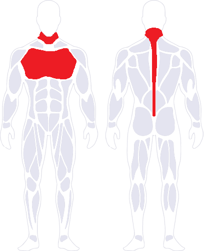

  

# Welcome to OShocker!

## This program is currently only functional with OpenShock as I do not have access to PiShock hardware.

### SAFETY FIRST!

#### You alone are responsible for any irresponsible use of this program and connected shocking devices  
##### Read about safe practices at [wiki.openshock.org](https://wiki.openshock.org/home/safety-rules) or [pishock.com](https://pishock.com/) under "Safety"  

### DO NOT WEAR ANY SHOCKING DEVICE NEAR THESE AREAS
  

## DOING SO MAY CAUSE INJURY
### Wearing the shocker near any of these Zones can cause:

* Heart Attack
* Irregular heartbeat
* Breathing irregularities or difficulty
* Vision or hearing issues
* Loss of consciousness

If you notice any of these symptoms, contact emergency services immediately.

##### Quoting:
You are playing with Electricity, always handle it with care.

**Do not** touch the pins of the shocker while it is on, it may not cause permanent damage to your hand but it is extremely painful.  
*[wiki.openshock.org/home/safety-rules](https://wiki.openshock.org/home/safety-rules)*

# Running this application

## Dependencies

[Python 3](https://www.python.org/downloads/) : For running the program.  
[Webhooks library](https://pypi.org/project/webhooks/) : For connecting to Tosu  
[Requests library](https://pypi.org/project/requests/) : For sending API calls  
[Tosu](https://github.com/tosuapp/tosu) : To read data from the game.  
[Osu! (Lazer)](https://osu.ppy.sh/home/download) : The game itself

## Installation
0. If you know you have something running on port 24050, make sure to stop it or change tosu's port
1. **Download** a recent Python version if needed
2. **Download** Tosu and extract the zip wherever, this is where I recommend keeping this project too for easy access.
3. **Download** This project as a zip and extract it in the tosu folder.
4. **Run** Setup.py before launching OShocker!, follow the instructions until setup finishes.
5. **Open** Osu! (Only tested on lazer) **and** tosu.exe
6. Once **both** applications have been opened, you may run OShocker!.py and configure your experience.  

P.S:  
Avoid opening OShocker! while a song is paused, it may register a shock.

## Features

* Shock intensity (0 - 100%) where "0%" is vibrations only
* Shock duration (0 - 10sec)
* Shock cooldown (0 - 10sec)
* Dynamic Shock (Increases intensity during a song by 5% every time you miss, resets back to normal after a retry or song change)
* Shock cap for dynamic shock
* Seems to work with every Osu! game mode so far
